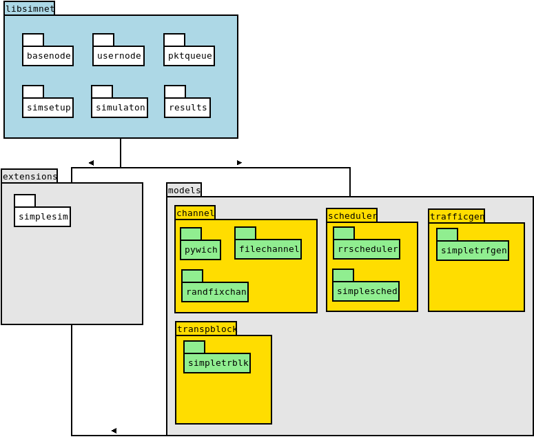
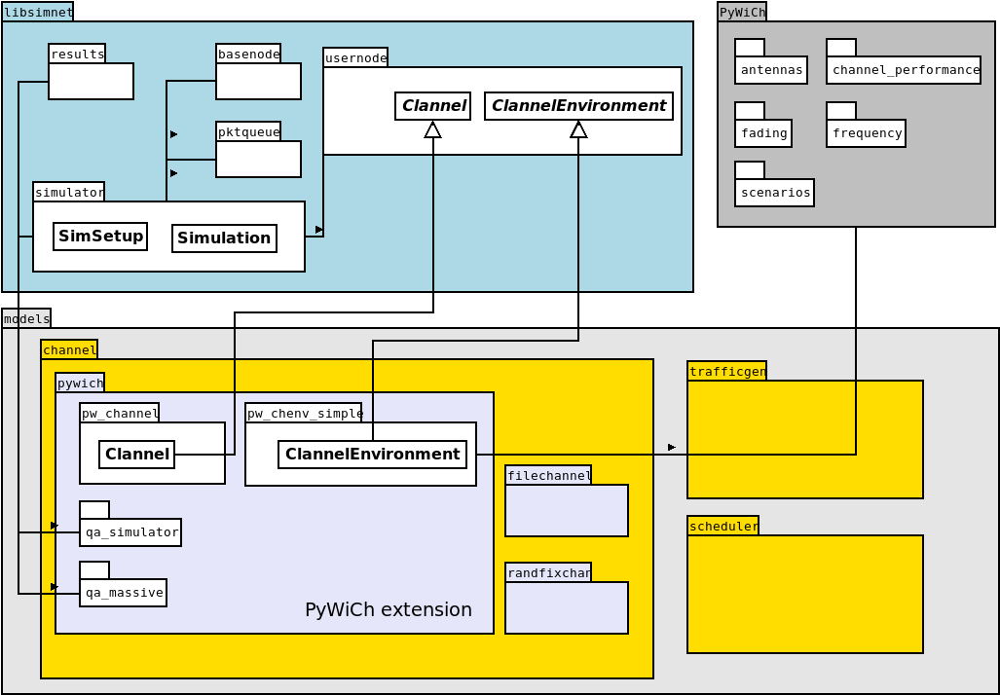

[Back to README](../README.md)


# Extension

This page explains how to extend the PyWiSim framework to add new funcionalities, implement new protocols or standards, or whatever modifications that may adapt the base classes to new requirements and situations.


## Abstract classes in Python

Abstract classes are classes that cannot be instantiated, but require subclasses to implement their functionality. In Python, an abstract class must inherit from the `ABC` class (Abstract Base Class) from the `abc` Python module, and must contain at least one abstract method, declared as such by using the `@abstractmethod` decorator. A Python class thus defined cannot be instantiated, but must be subclassed, and its abstract method must be overwritten.

In this version of PyWiSim, some of the base classes in the `libsimnet` library have been declared as abstract; this compells the user to overwrite these classes. However, concrete implementations may be taken from the PyWiSim simple example extension, optionally rewriting some classes. The PyWiSim simple exammple allows the user of the libsimnet classes to rely on a default, very simple but working functionality, when trying some specific, additional functionality of interest.


## Extensions and models

There are two ways to modify or extend the PyWiSim framework: extensions and models.

Extensions are implementations based on the PyWiSim framework for different telecommunications technologies, implementations which use different models for several entities, or implementation of a different simulation mode based on the PyWiSim framework. 

Models implement functionalities specific of an entity, such as channels, schedulers, traffic generators or others. This allows to use the PyWiSim framework, for instance by customizing its simple example, with implementations of different telecommunications standards, protocols, or experimental proposals for a specific entity.


## Directories involved

Extensions and different telecommunications models can be freely added outside the PyWiSim directory structure. However, to add functionalities to PyWiSim without altering the base classes as well as not interfering with other extensions, PyWiSim provides an orderly way to do so. The directories involved in an extension or model are:

- `libsimnet` : the main library, where base classes reside; this directory is assumed to be left untouched in an extension; it is not intended to be modified.
- `extensions` : contains the code for the extension, in a subdirectory with the extension name, e.g. `myextension`. The extension code may overwrite the libsimnet classes, as well as add new classes or functions, or import from external libraries. Tests for the extension are also expected to be included in this directory.
- `models` : contains the code for simulation models for different specific entities, such as channel, scheduler, traffic generator, or other. Classes defined here may also be imported into an extension based on the PyWiSim simple example, or to a totally new extension. 

Hence, programmers of different or additional functionalities are expected to create a subdirectory `myextension` in the `extensions` directory, or a subdirectory `mymodel` in the models directory, to include their own code and tests, with no need to modify anything in the `libsimnet` directory.

The following package diagram shows the directory structure and package dependencies for extensions and models.




## The extension procedure

To create an extension named `myextension`, the following steps are required:

1. Create a directory `extensions/myextension`.

2. In the new directory, add the extension modules required for the implementation of the new functionalities, either overwriting some of the `libsimnet` classes, or adding new classes and functions. Add test modules in this same directory.

3. To access the extension code, when defining the simulation scenery, import statements must make reference to the code in `extensions/myextension`.

To create a new model, the procedure is similar, creating the new model directory within the `models` directory.


## A simple simulator as an extension

A simple simulator coded as an extension of the `libsimnet` library can be found in the `extensions/simplesim` directory:

- simple implementations of the different entities are imported from the `models` directory, which contain classes wich overwrite `libsimnet` classes.
- script `qa_simulator.py` sets up a simple simulation scenery and runs the simulation.

The script `qa_simulator.py` uses a function `mk_imports()` from the `libsimnet.simulator` to import the overwritten classes. For example, to substitute an import for the Channel class, the following code was used:
```
    # in extensions.simplesim.qa_simulator.py
    from libsimnet.simulator import mk_imports
    from models.channel.randfixchan.randfix_chan import Channel 
        # randfix_chan.Channel overwrites abstract class in libsimnet
    ...
    global Channel  # when assignment is done within a function, e.g. __main__
    mk_imports(nm_channel=Channel)  # assigns overwritten Channel to Channel
    
``` 


## The PyWiCh channel model 

PyWiCh is a wireless communications channel simulator which has been integrated into PyWiSim as an extension. PyWiCh is an independent project, and its code evolves at its own pace, without interfering nor being conditioned by PyWiSim's own evolution. The PyWiCh channel extension is available in directory `models/channel/pywich`.
 
The following diagram shows the PyWiCh channel model. 




<!--
## The channel from file model

A channel from file model takes channel states from a CSV file. This allows for any channel simulator or channel state data from real communications to be used in a PyWiSim based simulator. The channel from file extension with some example channel state data is available in directory `models/channel/filechannel`. -->

[Back to README](../README.md)
