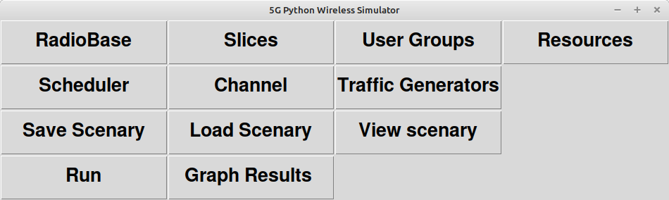

[Back to README](../README.md)

# The PyWiSim GUI

PyWiSim provides a Graphical User Interface for the 5G extension simulator. To test the GUI, in a Python command terminal do::

    $ cd <your PyWiSim installation directory>
    $ python3 extensions/sim5gnr/gui/AppGui.py

The 5G simulator GUI main windows should appear.

[Back to README](../README.md)

