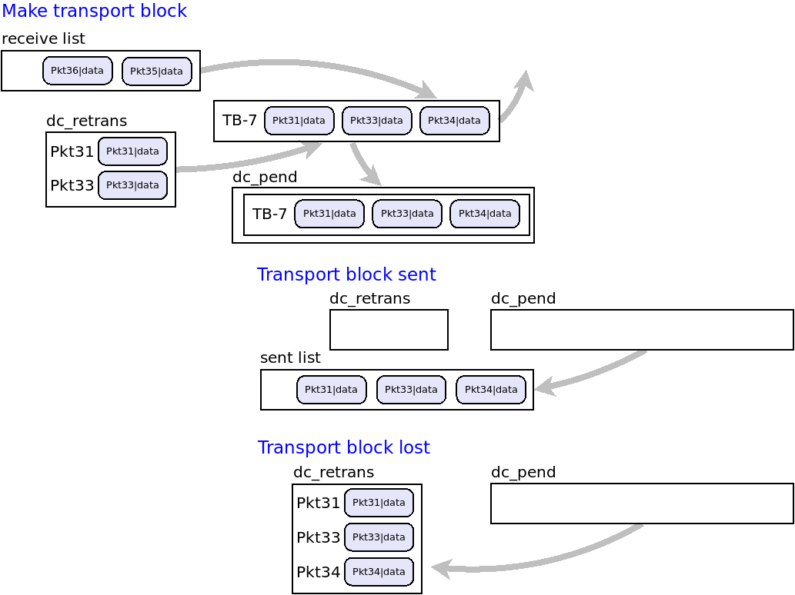

[Back to README](../README.md)

# Packet queue

Data packets generated by a traffic generator are added to a data packet queue. Each user equipment has its own packet queue. The PacketQueue class is responsible not only for receiving and sending data packets, but also for their transmission in transport block units, and their retransmission in the eventuality that the transport block is reported as lost in transmission.

The packet queue responds to requests of other entities which ask for packets to be grouped in transport block units, receive the transport blocks make by the packet queue, and report on their successful transmission or their loss, in which case the packet queue adds the packets lost into a retransmission dictionary. Please note that the packet queue provides these funcionalities as services to another entity handling the transmission, including the request for the transport block to be made, and informing the result of transmission, i.e. successful or lost. 

The process runs as follows:

1. Data packets from a traffic generator are added to the packet queue, in the order they arrive, into a receive list. 
2. When asked to do so, the packet queue extracts packets from the receive list and adds them into a unit called a "transport block" (TB), implemented as a list of packets. To this purpose a packet queue function receives a number of bits as a parameter, indicating the number of bits allowed to transmit according to the resources assigned to the user equipment owner of the queue. Each transport block is given a unique transport block identifier.
3. Each newly built transport block is returned to the caller of the function, but is also kept in a dictionary of pending transport blocks. The pending transport block dictionary acts as a storage of "on air" packets, packets that have been transmitted but not confirmed as successfully arrived to destination, and which may be lost.
4. When a transport block is confirmed as successfully sent by the entity responsible for transmission, the transport block is extracted from the dictionary of pending transport blocks, its packets are marked as sent, and optionally moved to a list of sent packets. Sent packets may also be discarded, once counters have been updated; this may be required by long simulations.
5. If a transport block is lost, which is informed by the entity responsible for the simulation, the transport block is extracted from the dicionary of pending transporg blocks and its packets are inserted into a dictionary of packets to be retransmitted. 
6. When the packet queue is instructed to make a new transport block, packets in the retransmission dictionary have priority over packets in the receive list. Hence, when building a new transport block, packets in the retransmission dictionary are considered first, and if the number of bits accepted for transmission have not been exhausted, packets from the receive list are considered.

The following diagram shows how the packet queue handles transmmission.

[Back to README](../README.md)

