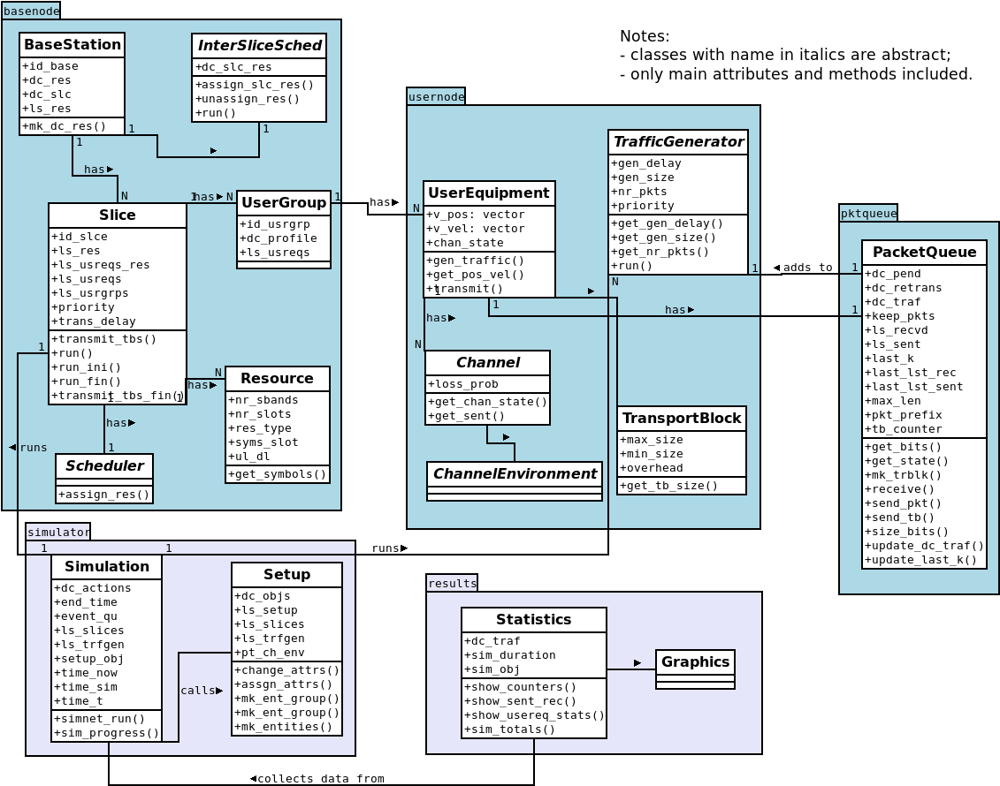
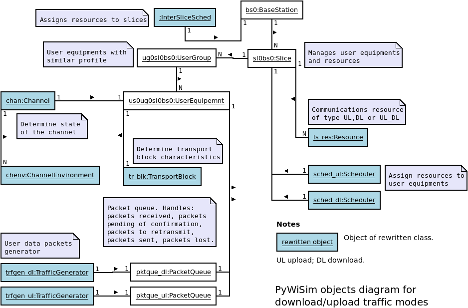

[Back to README](../README.md)

# The PyWiSim main library

## Classes

The following diagram shows classes in the PyWiSim main library. 

## Simulation objects

The following diagram shows objects and their relations in a simulation scenery.

[Back to README](../README.md)

