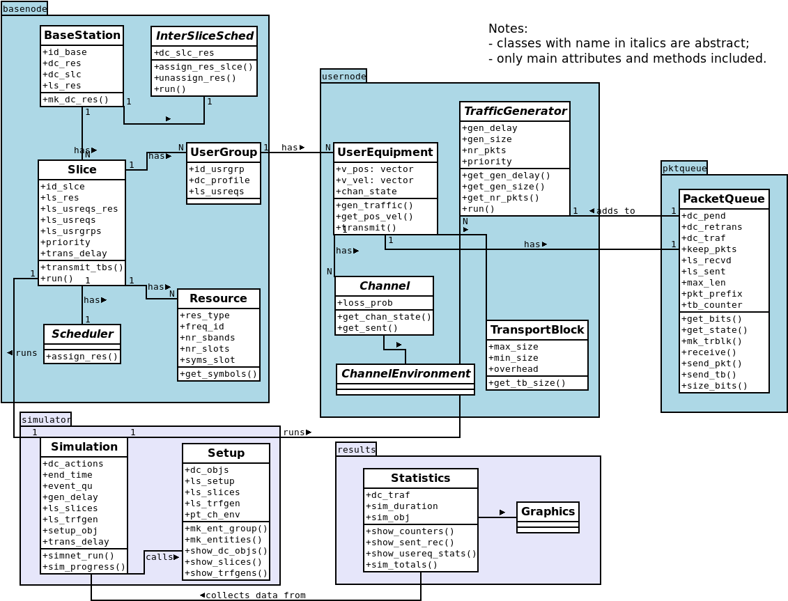
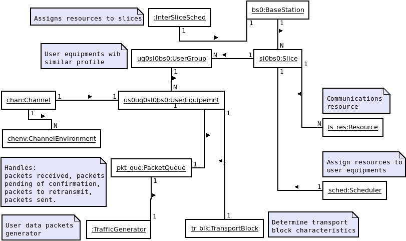

[SimNet wireless network simulator](https://gitlab.fing.edu.uy/vagonbar/simnet)

[Back to README](../README.md)

# The SimNet main library

## Classes

The following diagram shows classes in the SimNet main library. 

## Simulation objects

The following diagram shows objects and their relations in a simulation scenery.

[Back to README](../README.md)

